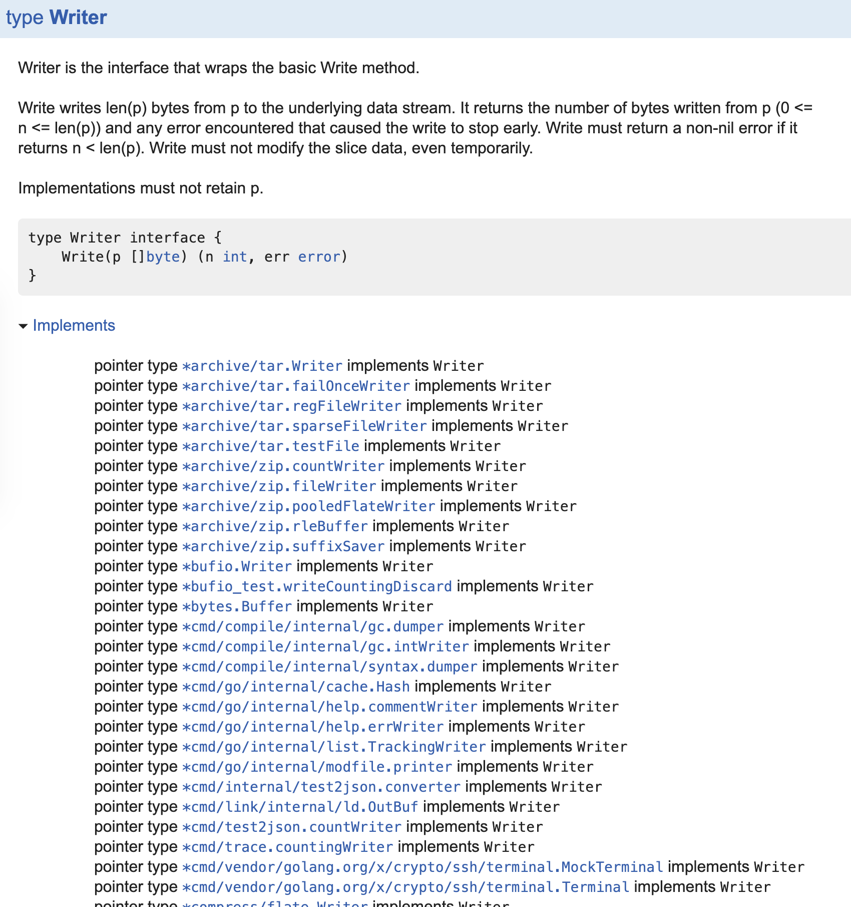
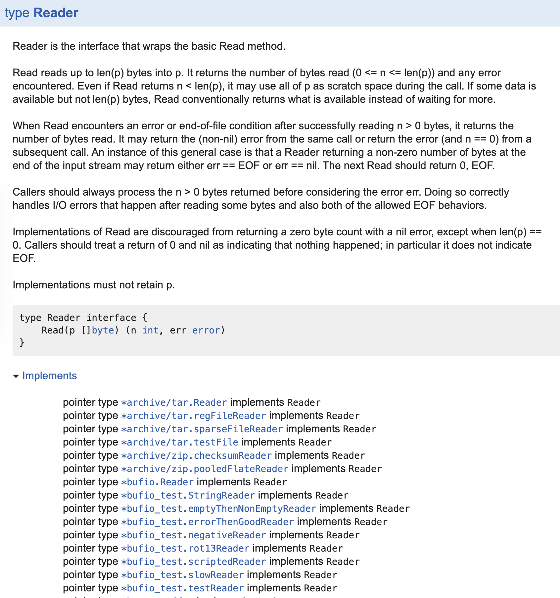

【TRY】io.Readerとio.Writer
================================================================================

io.Readerとio.Writerについて調べてみよう

Q.標準パッケージでどのように使われているか
--------------------------------------------------------------------------------

### io.Writer / io.Reader が実装されている package を探したい

Ref. https://ascii.jp/elem/000/001/243/1243667/#io.writerの実装状況利用状況を調べる

```
GOPATH=/ godoc -http ":6060" -analysis type
```

implements が見れるようになる。

io.Writer
http://localhost:6060/pkg/io/#Writer



io.Reader
http://localhost:6060/pkg/io/#Reader




- file への読み書き
- image への読み書き
- 圧縮ファイル への読み書き
- pipe への読み書き
- buffer への読み書き
- network通信への読み書き

等に使われている。


Q.io.Readerとio.Writerがあることで、どういう利点があるのか具体例を挙げて考えてみる
--------------------------------------------------------------------------------

(1) たとえば画像を扱うことを考えてみる。

画像を "どこに" 出力するのかを考えると色んなパターンがある。

- ブラウザ（html上に）出力する
- 圧縮してブラウザ上に出力する
- ファイルに出力する
- 出力しない (/dev/nullに出力する)

image/png.decoder 等は出力先を意識せずに、io.Readerに準じた reader であれば処理を行えるから、便利。

(2) たとえば画像のテストを書くことを考えてみる。

画像ファイルを出力するようなプログラムでテストを書くときに
実際にファイルを出力せずに buffer に出力する、とかができそう。


【TRY】テストを書いてみよう
================================================================================

1回目の宿題のテストを作ってみて下さい

- [x] テストのしやすさを考えてリファクタリングしてみる
- [x] テストのカバレッジを取ってみる
    - https://blog.golang.org/cover
- [x] テーブル駆動テストを行う
- [x] テストヘルパーを作ってみる


```
go test -v -race -cpu=2 -coverprofile=coverage.out  ./...
```

output coverage

```
go tool cover -func=coverage.out
```

```
go tool cover -html=coverage.out
```
